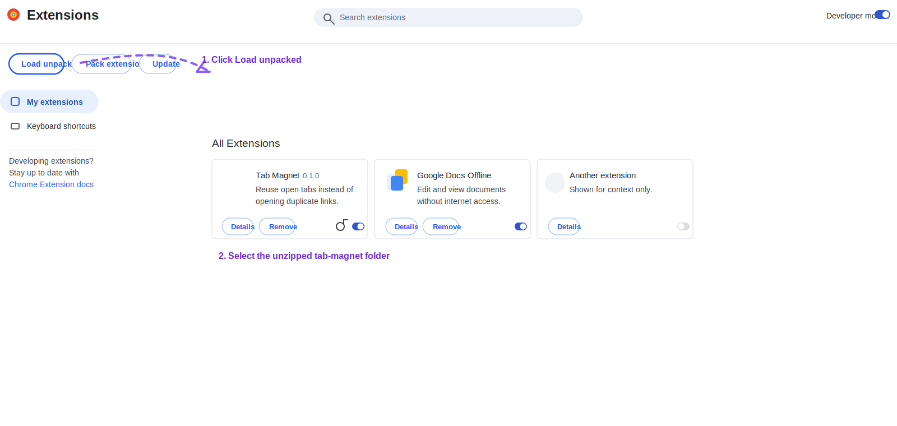

# Tab Magnet

**Reuse open tabs.**

Tab Magnet is a tiny Chrome extension that switches to an already-open tab instead of opening duplicate links.

## Install from a release zip

1. Download the latest `tab-magnet.zip` from the [Releases page](../../releases/latest).
2. Unzip it.
3. Open `chrome://extensions`.
4. Enable **Developer mode**.
5. Click **Load unpacked**.
6. Select the unzipped `tab-magnet` folder.

## Install from source

1. Clone this repo.
2. Open `chrome://extensions`.
3. Enable **Developer mode**.
4. Click **Load unpacked**.
5. Select this `tab-magnet` folder.

## Behavior

- Exact URL match: automatically switches to the existing tab and closes the duplicate.
- Similar URL match: asks whether to:
  - switch to the existing tab,
  - update the existing tab to the new URL,
  - or keep the new tab.

## Site access

By default, Tab Magnet only runs on:

- GitHub
- Linear
- localhost
- 127.0.0.1

Open the extension settings to add more sites or enable all websites.

## Privacy

- No analytics
- No network requests
- No content scripts
- No page content access
- Reads tab URLs only to compare open tabs
